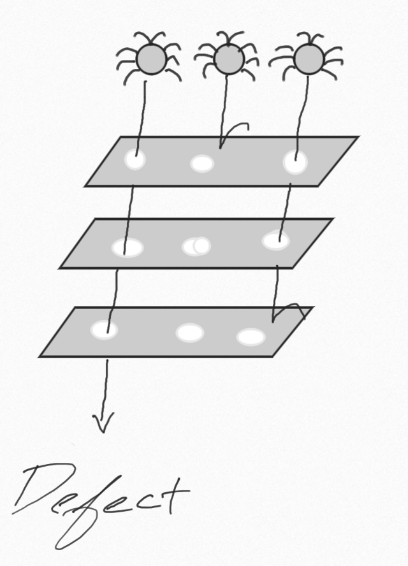
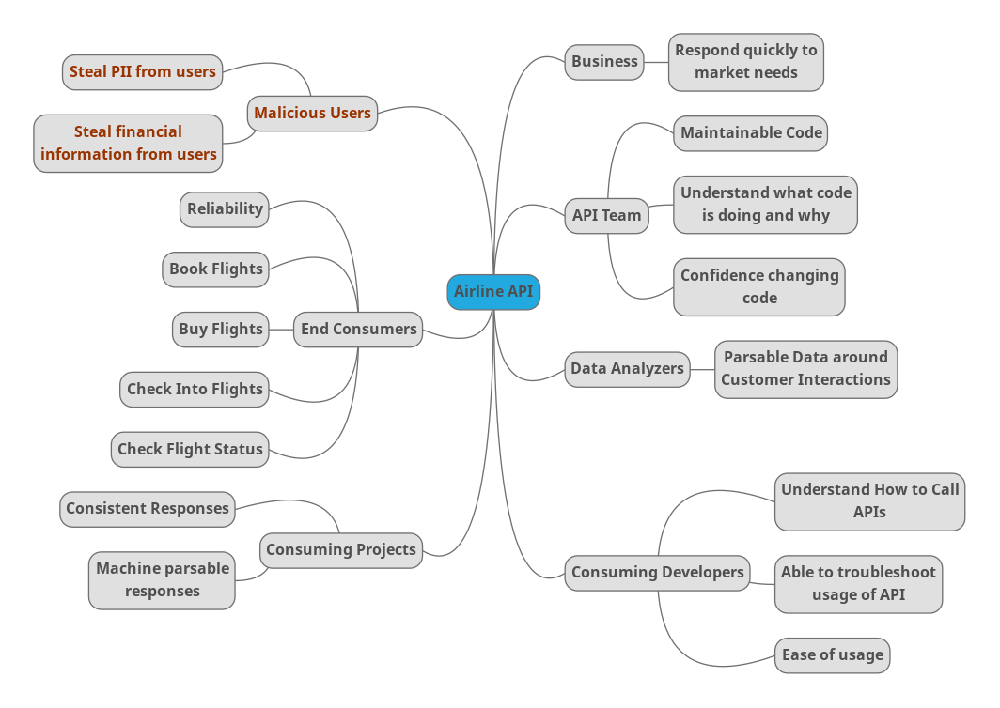
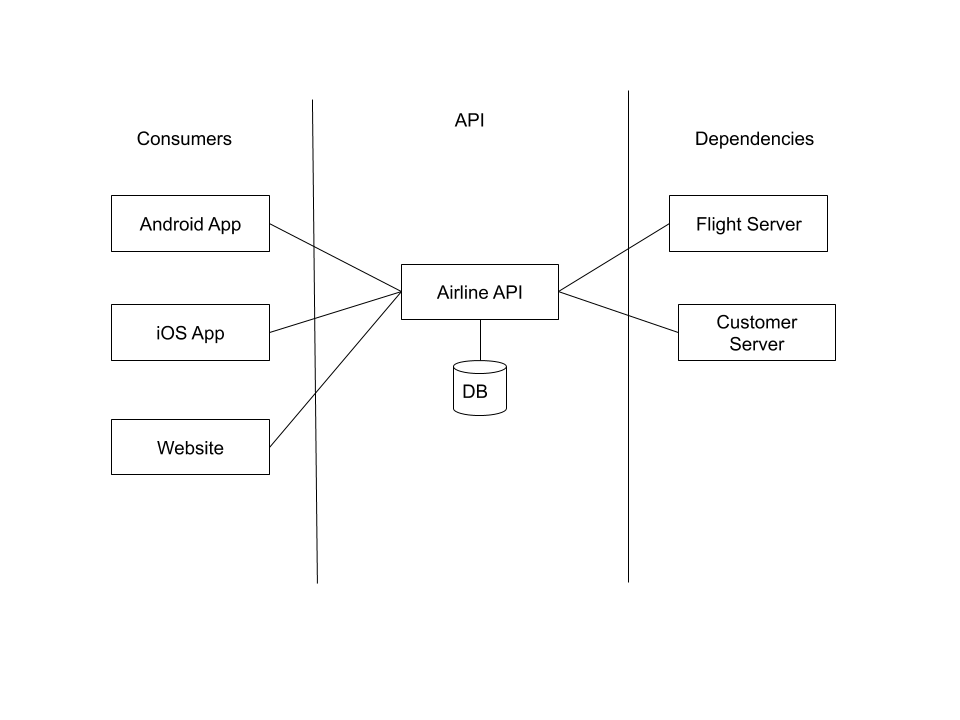
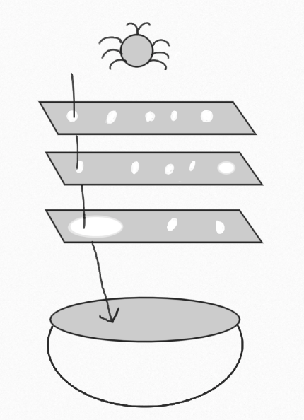

# WHAT IS THE SWISS CHEESE MODEL?

A multi-layered approach to ensuring the quality of a project, inspired by the Swiss cheese model of accident prevention used in aviation safety, engineering, and many other industries.

Just as swiss cheese has holes, so to will any layer you introduce into a software development strategy. For example, a unit test suite can be very effective at testing the functionality of individual methods, but if you integrate with outside systems, unit tests alone fall short of providing full coverage.

Furthermore, using a multi-layered approach enables you to ask if it is reasonable for a layer to handle a particular event. Thinking about UI tests, they can be capable of testing many features, however, the slow and more costly nature of UI tests means it is not effective to have a large number of them.

The final important note is a quality strategy is about more than just your automated tests. It is how you approach a problem, the analysis you do, the metrics you put in place to ensure what you are doing accomplishes the goal.

# HOW DO I USE IT?

In order to exemplify how to use this model, we are going to go through the process for a generic airline API. In this example, our API will have three consumers (the website, the iOS app, and the android app) and two dependencies (a service which provides flight information and a database of customer information)

## Understand Who Cares

First, in order to know what your layers should be, you need to know what your concerns will be. Start with identifying key players – aka who cares about the project – and identify the concerns they have.

Here is an example for a generic airline app API:

For this exercise, it is important to note everyone and everything the app effects, regardless of their importance to the project and whether they are an intended actor (eg, end customers), negative actor (eg, malicious users), or indirect actor (business). Prioritization can come later, but it is important this exercise is an unfiltered list.

As a result, we not only identify the end customers and business, but we also call out the team who has to consume it, the consuming apps, our own team who needs to support it, and malicious users who will want to exploit it.

Understanding the various people who care about what we are doing enables us to make a better strategy, but also enables us to more effectively look at these when weighing priorities.

For example, even if malicious users are not usually considered in discussions around business needs, we still need to evaluate the risks associated with them – does our app handle sensitive information? Does our app give malicious users another door to get into the system with? Does our app make it easier for our users to fall prey to social hacking? If the answer to any of these is yes, the security the API must put into place needs to be weighed more heavily.

We need to keep our immediate consumers in mind, not just the end users, as the immediate consumers are the ones interacting with our API. Knowing what they would use the API for and what the needs of the programs they are writing can guide our ability to write tests and evaluate the responses appropriately.

Understanding what the business seeks to gain from the API helps us understand whether we are even building the right thing. For example, if our API is difficult to extend even though it is otherwise wonderful to use and incredibly reliable, it would fail the business need (in this example) of responding to the market quickly.

The teams building and maintaining the API should be called out as their interactions with the API matter. If this team isn’t able to effectively work with their own project, even if it is wonderful to the outside world, there is a large risk due to maintenance concerns as well as future security risks.

Finally, we want to make certain to call out any usage inside the business outside the normal feature -> customer relationship such as data analytics teams. Understanding these teams needs can help shape what sort of logs we are making. Integrating thinking about them from the very beginning makes for a more effective strategy.

## Understand Architecture

The next step is to take a look at your intended architecture. Even if the specifics might change, this step is for highlighting things such as integration points and dependencies. Additionally, as you learn more about the architecture, you can use the information to update your strategy based on the changes from the initial picture.

The proposed architecture this fictional team has at this point in the project (the very beginning), involves a DB for any information the API needs to keep track of (eg, authentication information) which is independent of its dependencies.

Once you have this drawing, you should think about the lines between them.

For example, the two apps will likely usually be contacting the API on unsecured and potentially unreliable networks. The two servers in our scenario are both in house in the same system as the API itself. The website is more likely to be used from home and hotel computers – still high potential for insecure connections. These are all factors which should be considered for the strategy.

## Match Concerns to Layers

Once you have gathered concerns from 2 areas – the people/things who care and the architecture – it is time to create layers and decide what layer is intended to handle which concerns.

Sometimes a concern might need multiple layers – if you can break down the concern in a way which shows why, this helps with better understanding the concern. Eg, one concern noted above is around the malicious users who will want to exploit the system. We can break this down into at least two smaller concerns: wanting confidence hacking the system will be difficult (via penetration testing) and wanting to ensure developers do not introduce common code vulnerabilities (via static code analysis).

Similarly, a layer can also handle multiple concerns. It is a good idea to note when this is the case for if in the future a concern is moved to a different layer, but the other concerns are not able to move.

Noting what layers cover which concerns also makes it easier to know when to retire a layer. If you introduce a new layer which takes on concerns from others and accomplishes them in a better way, the old ones should be retired. The intent for a strategy is to be the most cost (time & resources) effective while giving the business and team confidence in the product they are building.

Some example concern-to-layer mappings:

Customer experience -> product analysis
Delivery team confidence around changing code -> Unit tests
Ease of understanding old work when on new features -> Unit tests
Difficult to hack system -> Penetration testing
Stop introducing vulnerabilities to the code -> Static code analysis

# THINGS TO BE AWARE OF

Layers cost money. Everything has a price. In the above example, penetration testing can be an expensive timely affair and depending on the working relationship with the penetration testers, will likely involve a lot of work on the dev team’s part to ensure their work is done within certain parameters and time to make the best use of the penetration testers’ time.

Ultimately a layer needs to always be worth its cost. If you are introducing a layer which only protects you from something minor whose risk, cost to fix, and impact on business are all low, this might not be a layer worth introducing. Every layer should be preventing something impactful enough to justify the cost of introducing and maintaining it.

# HOW DO YOU KNOW IT IS WORKING?

To answer this question, there is a small modification we need to make to the image of the swiss cheese model introduced above.

There is no such thing as perfection. There can be flaws in every step of the process or simply a shift in the market leading to a product not performing to perfection. As a result, we cannot measure our strategy’s success simply by bugs or some similar metric. Instead, our metric should focus on the fallout when there is a problem.

Many companies have some sort of Customer Success team, who are the first line when customers need help or have feedback. This team, or whatever your group uses as its first line, represents the bowl at the bottom – they are who deals with what falls through, whether it be a confusing customer experience, a bug interfering with customers, or market fall out due to an exposed security vulnerability.

Your strategy succeeds so long as that team is succeeding. If they are falling behind or otherwise overwhelmed (eg, catastrophic bug happens), then you are not succeeding and should examine your process with what is happening to see what can be improved with the information from Customer Success.